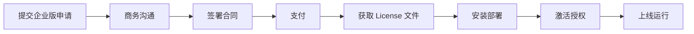

# Form-A 企业版 K8s 部署文档

> **文档版本**: v1.0 | **更新日期**: 2026-07-15 | **产品名称**: Form-A Enterprise K8s Edition

---

## 一、什么是 Form-A 企业版？

Form-A 企业版（Enterprise Edition）是在社区版功能基础上，专为企业级生产环境打造的**高可用、授权可控、开箱即用**的 AI 自动化平台。企业版通过 Kubernetes 原生部署，将 n8n 工作流引擎、AI-API 网关、AI 模型服务等核心组件以微服务架构编排，提供企业级 SLA 保障。

---

## 二、架构差异：企业版 vs 社区版

| 对比维度 | 社区版 (Community) | 企业版 (Enterprise) |
|---------|-------------------|-------------------|
| **部署方式** | Docker Compose 单机 | Kubernetes 集群化部署 |
| **高可用** | ❌ 无（单点故障） | ✅ 全组件多副本 + Patroni HA |
| **数据库** | SQLite / 单机 PostgreSQL | Patroni 高可用 PostgreSQL 集群 |
| **授权机制** | 无限制 | License 授权 + Auth Server |
| **扩展能力** | 垂直扩展（单一节点） | 水平扩缩容（kubectl scale） |
| **监控告警** | 无内置 | Prometheus + Grafana 对接 |
| **安全合规** | 基础 | TLS + NetworkPolicy + RBAC |
| **技术支持** | 社区论坛 | 24h 响应 SLA 金牌支持 |
| **定价** | 免费 | ¥49,800 / 年 |

---

## 三、核心卖点

### 🔒 授权可控
- 企业 License 严格绑定集群 UID，防扩散
- License 覆盖**不限流不限量** — 不限制工作流数、用户数、API 调用次数
- Auth Server 统一认证，可对接 LDAP / OAuth2

### ⚡ 高可用
- 所有无状态组件 ≥ 2 副本，滚动更新零停机
- PostgreSQL 采用 Patroni + etcd 集群，故障自动切换 < 30s
- AI-API 网关自动熔断与重试

### 🚀 开箱即用
- 单条 `helm install` 命令完成部署
- 内置 50+ 企业级 AI 工作流模板
- 预配置日志、监控、告警集成
- 提供一键迁移工具（社区版 → 企业版）

---

## 四、部署要求

### 资源规格（最小生产级）

| 节点角色 | 节点数 | CPU | 内存 | 磁盘 |
|---------|--------|-----|------|------|
| Master | 1 | 4C | 8G | 100GB SSD |
| Worker | ≥2 | 4C | 8G | 200GB SSD |
| **合计** | **≥3** | **≥12C** | **≥24G** | **≥500GB** |

> 容量估算以 200 并发工作流、100 个 AI Agent 为基准。
> 实际需求请根据业务量调整，详细计算参考 `scaling-guide.md`。

### 软件要求

| 组件 | 版本要求 | 说明 |
|------|---------|------|
| Kubernetes | ≥ 1.28 | 推荐 1.30+ |
| Helm | ≥ 3.12 | 包管理工具 |
| kubectl | 与集群版本匹配 | 管理客户端 |
| Ingress Controller | nginx-ingress ≥ 1.9 | 流量入口 |
| StorageClass | 支持 ReadWriteMany | PV 动态供给 |

### 网络要求

- 所有节点间内网互通（建议 ≥ 10Gbps）
- 对外暴露 443 (HTTPS) 端口
- etcd 集群节点间 2379/2380 端口互通
- Pod 网络 CIDR 不与宿主机冲突（默认 10.244.0.0/16）

---

## 五、定价与授权

### 定价方案

| 版本 | 价格 | 含技术支持 | 部署节点数 |
|------|------|-----------|-----------|
| 企业版（基础） | ¥49,800 / 年 | 5×8 工单支持 | 3-5 节点 |
| 企业版（高级） | ¥89,800 / 年 | 7×24 金牌支持 | 10 节点以内 |
| 企业版（旗舰） | 联系我们 | 专属客户经理 | 不限节点 |

### 购买流程



1. **提交申请**：联系销售团队（sales@form-a.io）或官网提交企业版意向
2. **商务沟通**：确认需求、节点规模、服务方案
3. **签署合同**：电子签约，支持企业对公账户
4. **支付**：银行转账 / 对公网银
5. **获取 License**：支付完成后 1 个工作日内交付 License 文件
6. **安装部署**：参见 `deploy-enterprise.sh` 及 Helm Chart 文档
7. **激活授权**：Auth Server 自动加载 License 完成激活

---

## 六、文档目录索引

| 文档 | 说明 |
|------|------|
| `architecture-overview.md` | K8s 架构设计与命名空间策略 |
| `helm-chart/README.md` | Helm Chart 结构与 values 参数 |
| `deploy-enterprise.sh` | 一键部署脚本 |
| `postgres-high-availability.md` | PostgreSQL Patroni 高可用方案 |
| `enterprise-auth-integration.md` | 授权与认证集成 |
| `scaling-guide.md` | 扩缩容指南 |
| `production-checklist.md` | 生产上线检查清单 |

---

## 七、快速入门

```bash
# 1. 准备 License 文件
cp license.key /etc/form-a/license/

# 2. 添加 Helm 仓库
helm repo add form-a https://helm.form-a.io/enterprise
helm repo update

# 3. 安装企业版
helm install form-a-enterprise form-a/ai-cluster-enterprise \
  --namespace form-a-system --create-namespace \
  --values custom-values.yaml

# 4. 验证部署
kubectl -n form-a-system get pods
```

> 完整部署步骤详见 `deploy-enterprise.sh` 和 `production-checklist.md`。
