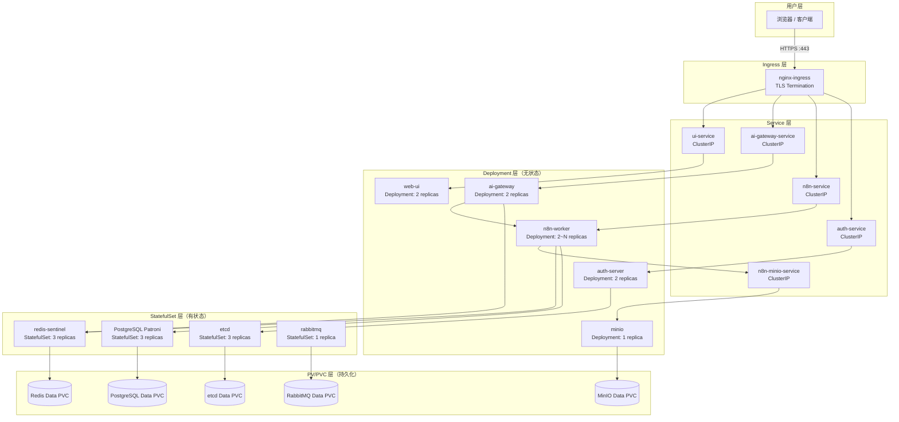

# Form-A 企业版 K8s 架构设计

> **文档版本**: v1.0 | **更新日期**: 2026-07-15

---

## 一、整体架构

企业版采用 **Kubernetes 原生微服务架构**，所有组件以 Deployment / StatefulSet 方式编排，通过 Service 层解耦，Ingress 统一代理，PV/PVC 持久化数据。

---

## 二、核心架构图

### 2.1 流量与组件关系



### 2.2 组件清单

| 组件 | 类型 | 副本数 | 说明 |
|------|------|--------|------|
| nginx-ingress | DaemonSet / Deployment | ≥2 | TLS 终止，统一入口 |
| auth-server | Deployment | 2 | License 校验 + LDAP/OAuth2 认证 |
| n8n-worker | Deployment | 2（可扩容） | 工作流执行引擎 |
| ai-gateway | Deployment | 2 | AI API 反向代理与熔断 |
| web-ui | Deployment | 2 | 管理控制台前端 |
| Postgres Patroni | StatefulSet | 3 | 高可用 PostgreSQL |
| etcd | StatefulSet | 3 | Patroni 一致性存储 |
| redis-sentinel | StatefulSet | 3 | n8n 队列 + 缓存 |
| rabbitmq | StatefulSet | 1 | 异步消息代理 |
| minio | Deployment | 1 | 工作流文件存储 |

---

## 三、命名空间隔离策略

### 3.1 命名空间规划

```
form-a-system          # 核心系统组件
  ├── auth-server       # 授权与认证
  ├── nginx-ingress     # 流量入口
  ├── ai-gateway        # AI API 网关
  └── web-ui            # 管理控制台

form-a-workflows       # 工作流执行环境
  ├── n8n-worker        # 工作流引擎
  └── n8n-minio         # 文件存储

form-a-data            # 数据持久层
  ├── postgres-patroni  # 主数据库
  ├── etcd              # etcd 集群
  ├── redis-sentinel    # 缓存
  └── rabbitmq          # 消息队列

form-a-monitoring      # 监控与日志（按需部署）
  ├── prometheus
  ├── grafana
  └── loki
```

### 3.2 隔离策略

| 策略类型 | 实现方式 | 说明 |
|---------|---------|------|
| **网络隔离** | Kubernetes NetworkPolicy | 默认 deny-all，按需放行跨命名空间流量 |
| **RBAC 权限** | ClusterRole + RoleBinding | 每个命名空间仅授权必要操作 |
| **资源配额** | ResourceQuota + LimitRange | 防止资源争抢 |
| **存储隔离** | 独立 PVC per StatefulSet | 有状态组件互不干扰 |
| **Secret 隔离** | 每个命名空间独立管理 Secret | License key、数据库密码等分仓管理 |

### 3.3 关键 NetworkPolicy 规则（示意）

```yaml
# 允许 form-a-system 访问 form-a-data 的 5432 端口
apiVersion: networking.k8s.io/v1
kind: NetworkPolicy
metadata:
  name: allow-system-to-pg
  namespace: form-a-data
spec:
  podSelector:
    matchLabels:
      app: postgres-patroni
  ingress:
  - from:
    - namespaceSelector:
        matchLabels:
          kubernetes.io/metadata.name: form-a-system
    ports:
    - port: 5432
```

---

## 四、服务发现与通信

```
命名空间隔离 · 服务间通信模式
═══════════════════════════════════

form-a-system ────→ form-a-data
    │                    │
    │   n8n-worker ─────→ postgres-patroni:5432
    │   n8n-worker ─────→ redis-sentinel:6379
    │   auth-server ────→ etcd:2379
    │   ai-gateway ─────→ redis-sentinel:6379
    │
    └─── DNS 解析: <service>.<namespace>.svc.cluster.local
```

所有服务间通信通过 Kubernetes Service DNS 完成，格式：

```
<service-name>.<namespace>.svc.cluster.local
```

例如：`postgres-patroni.form-a-data.svc.cluster.local:5432`

---

## 五、高可用设计要点

1. **Ingress 层**：nginx-ingress 多副本 + HPA，前端挂载 SLB/ELB 做流量分发
2. **Service 层**：ClusterIP + kube-proxy iptables/IPVS 模式，自带负载均衡
3. **无状态层**：Deployment + ReadinessProbe + PodDisruptionBudget，滚动更新
4. **有状态层**：StatefulSet + 反亲和性调度，保证跨节点分布
5. **存储层**：推荐使用企业级分布式存储（Ceph / Longhorn / NAS），避免单点存储故障

---

## 六、社区版 → 企业版架构升级要点

| 差异项 | 社区版 | 企业版 |
|--------|--------|--------|
| 数据库 | SQLite 本地文件 | Patroni HA 集群 |
| 队列 | 内存队列 | Redis + RabbitMQ |
| 存储 | 本地文件 | MinIO 对象存储 |
| 认证 | 无 | Auth Server + LDAP/OAuth2 |
| 高可用 | ❌ | ✅ 全链路多副本 |
| 扩缩容 | 重启应用 | `kubectl scale deployment` |

---

> 相关文档：[README.md](./README.md) · [Helm Chart](./helm-chart/README.md) · [部署脚本](./deploy-enterprise.sh)
