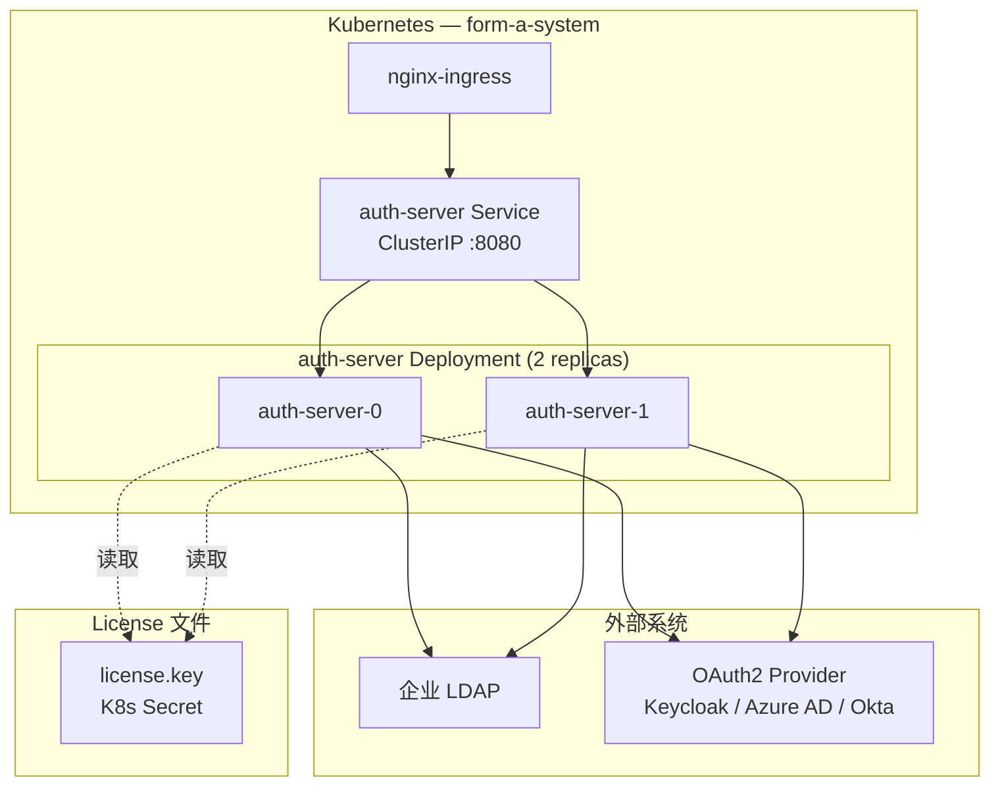
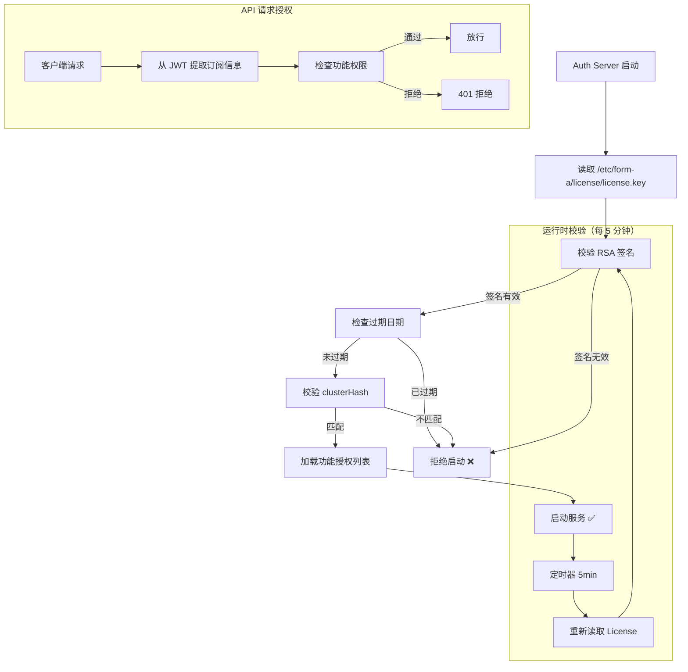
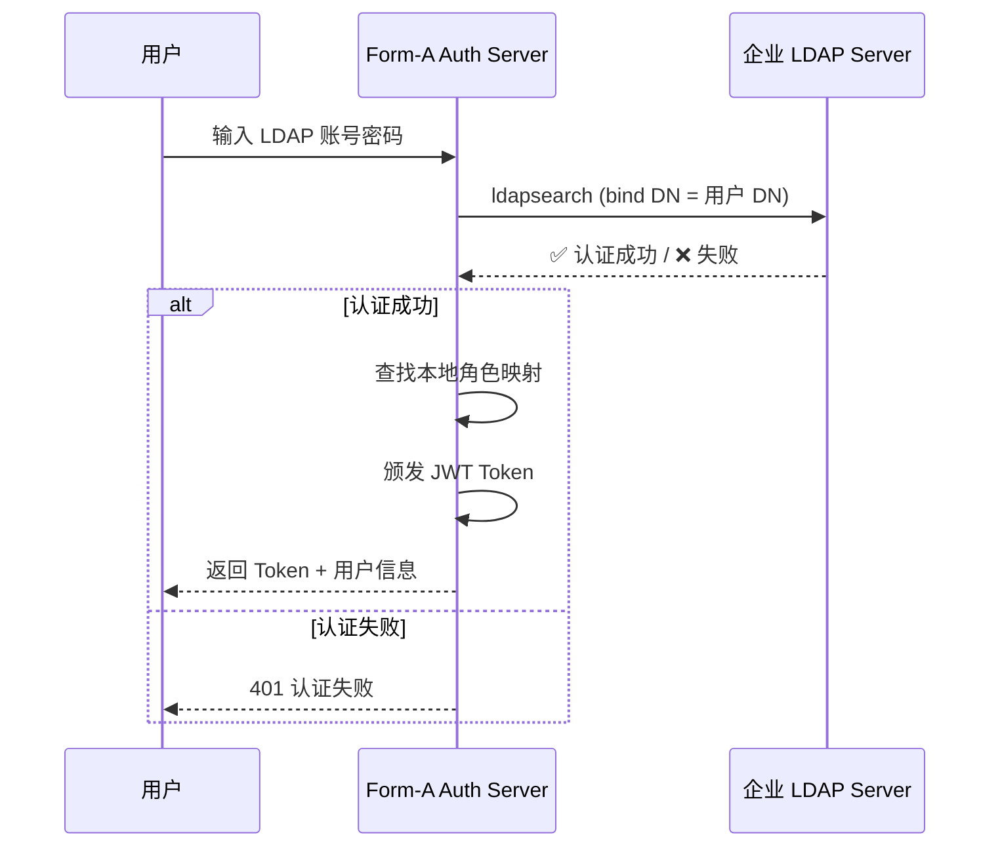
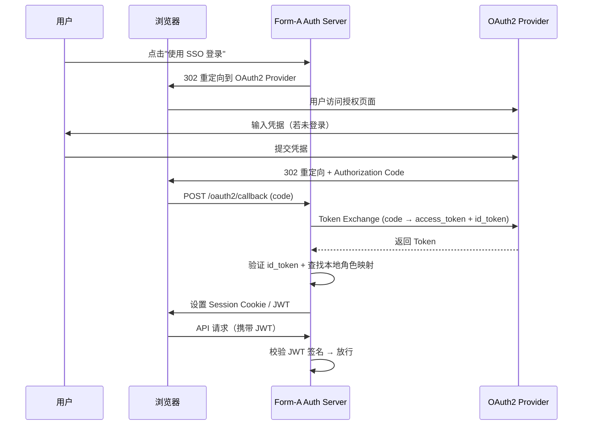

# 企业版授权集成说明

> **文档版本**: v1.0 | **更新日期**: 2026-07-15 | **适用组件**: auth-server

---

## 一、概述

企业版授权认证体系由 **auth-server** 组件提供，以 Deployment 方式部署（至少 2 副本），负责：

1. **License 校验** — 验证企业 License 的合法性与有效性
2. **身份认证** — 支持内置账户体系的登录认证
3. **外部认证集成** — 对接企业已有 LDAP / OAuth2 / SAML 认证系统

---

## 二、Auth Server 架构



### 高可用设计

- **多副本**：至少 2 副本，滚动更新零停机
- **无状态**：auth-server 不存储会话状态，Session Token 使用 JWT（无状态化）
- **共享存储**：License 文件通过 K8s Secret 挂载，所有副本读取同一份授权数据
- **PodDisruptionBudget**：保证至少 1 个副本可用

```yaml
apiVersion: policy/v1
kind: PodDisruptionBudget
metadata:
  name: auth-server-pdb
  namespace: form-a-system
spec:
  minAvailable: 1
  selector:
    matchLabels:
      app.kubernetes.io/component: auth-server
```

---

## 三、License 验证机制

### 3.1 License 文件格式

企业版 License 是一个经过数字签名的 JSON 文件，内容示例如下：

```json
{
  "licenseId": "ENT-2026-XXXX-XXXX",
  "issuedTo": "示例科技有限公司",
  "issuedAt": "2026-07-01T00:00:00Z",
  "expiresAt": "2027-07-01T00:00:00Z",
  "features": ["n8n-worker", "ai-gateway", "postgres-ha", "ldap-integration"],
  "clusterHash": "sha256$f8a2b3c4...",
  "maxNodes": 5,
  "signature": "MEUCIQCDq4Pm..."
}
```

| 字段 | 说明 |
|------|------|
| `licenseId` | License 唯一编号 |
| `issuedTo` | 被授权企业名称 |
| `issuedAt` | 颁发日期 |
| `expiresAt` | 过期日期（到期前 30 天开始告警） |
| `features` | 授权功能特性列表 |
| `clusterHash` | 绑定集群 UID 的哈希值（防 License 扩散） |
| `maxNodes` | 授权节点数上限 |
| `signature` | RSA-SHA256 数字签名（防篡改） |

### 3.2 验证流程



### 3.3 社区版 vs 企业版 License 差异

| 对比维度 | 社区版 | 企业版 |
|---------|--------|--------|
| **是否必须** | 可选 | **强制** — 无 License 无法启动 |
| **工作流数限制** | 不限 | 不限 |
| **用户数限制** | 不限 | 不限 |
| **绑定方式** | 不绑定 | 绑定集群 UID |
| **过期处理** | 无 | 到期前 30 天告警，到期后 7 天锁定 |
| **API 调用限制** | 不限（无 SLA） | 不限（含 SLA） |
| **验证频率** | 仅启动时 | 启动时 + 每 5 分钟 |

### 3.4 部署 License

```bash
# 1. 将 License 文件创建为 K8s Secret
kubectl create secret generic form-a-license \
  --namespace form-a-system \
  --from-file=license.key=/path/to/license.key

# 2. 验证 Secret 已正确创建
kubectl get secret form-a-license -n form-a-system -o yaml
```

---

## 四、企业版授权限制说明

企业版 License 在功能层面**不限制**以下维度：

| 维度 | 限制情况 |
|------|---------|
| 工作流数 | ✅ **不限** — 创建多少工作流均可 |
| 活跃用户数 | ✅ **不限** — 支持任意数量的用户账户 |
| 并发执行数 | ✅ **不限** — 取决于集群资源，License 不设阈值 |
| AI Agent 数 | ✅ **不限** — 创建任意数量的 AI Agent |
| API 调用次数 | ✅ **不限** — 无调用次数硬限制 |

限制的是**部署范围**：

| 限制维度 | 说明 |
|---------|------|
| **节点数** | License 注明授权节点数上限（如 5 节点/10 节点） |
| **集群绑定** | License 绑定一个集群 UID，不可在不同集群间复用 |
| **功能集** | 根据购买版本解锁不同功能模块 |

> **为什么不限工作流和用户数？** Form-A 企业版定位为企业级基础设施，产品设计的哲学是让用户用技术资源竞争，而不是被 License 卡住业务增长。

---

## 五、LDAP 集成（概念说明）

### 5.1 适用场景

企业已有 LDAP 服务器（如 OpenLDAP、AD），希望用户使用 LDAP 账号直接登录 Form-A 管理平台，无需另行注册。

### 5.2 集成原理



### 5.3 Auth Server 配置（LDAP）

```yaml
# values.yaml 中的 LDAP 配置
auth-server:
  ldap:
    enabled: true
    # LDAP 服务器连接
    url: "ldap://ldap.example.com:389"
    startTLS: true

    # 搜索基础
    baseDN: "dc=example,dc=com"
    userSearchBase: "ou=people,dc=example,dc=com"
    userSearchFilter: "(uid={0})"

    # 管理员绑定
    adminDN: "cn=admin,dc=example,dc=com"
    # 密码通过 Secret 注入

    # 角色映射（将 LDAP 组映射到 Form-A 角色）
    roleMapping:
      admin:
        ldapGroup: "cn=form-a-admins,ou=groups,dc=example,dc=com"
      editor:
        ldapGroup: "cn=form-a-editors,ou=groups,dc=example,dc=com"
      viewer:
        ldapGroup: "cn=form-a-viewers,ou=groups,dc=example,dc=com"
```

---

## 六、OAuth2 集成（概念说明）

### 6.1 适用场景

企业已部署 OAuth2 / OIDC 认证系统（如 Keycloak / Azure AD / Okta / Auth0），希望实现 SSO 单点登录。

### 6.2 集成原理



### 6.3 Auth Server 配置（OAuth2）

```yaml
# values.yaml 中的 OAuth2 配置
auth-server:
  oauth2:
    enabled: true

    # 支持的 Provider 类型
    provider: "keycloak"   # keycloak / azure-ad / okta / custom

    # 通用配置
    clientId: "form-a-enterprise"
    clientSecret: "xxxxx-xxxxx-xxxxx"   # 通过 Secret 注入
    redirectUri: "https://form-a.example.com/oauth2/callback"
    issuerUrl: "https://auth.example.com/realms/form-a"

    # 范围
    scopes:
      - "openid"
      - "profile"
      - "email"
      - "groups"

    # 角色映射（从 OAuth2 claims → Form-A 角色）
    claimMapping:
      userIdentifierClaim: "email"
      groupClaim: "groups"
      roleMapping:
        form-a-admin: "admin"
        form-a-editor: "editor"
        form-a-viewer: "viewer"
```

---

## 七、多认证源并存策略

企业版支持同时启用多个认证源，用户登录时可以选择认证方式：

```yaml
auth-server:
  # 内置账户（始终启用）
  localAuth:
    enabled: true

  # LDAP（可选）
  ldap:
    enabled: true

  # OAuth2（可选）
  oauth2:
    enabled: true
```

**认证优先级**：
1. 用户选择认证方式（登录页面切换 Tab）
2. 同一邮箱在不同认证源中有账号 → 自动合并为同一用户
3. 所有认证源颁发的 JWT 均兼容，对 n8n 工作流透明

---

## 八、安全注意事项

| 要点 | 说明 |
|------|------|
| **License 保密** | License 文件视为最高机密，存储在 K8s Secret 中，**禁止**硬编码或提交到代码仓库 |
| **TLS 加密** | auth-server 必须通过 HTTPS 对外暴露，禁止明文传输密码 |
| **密码策略** | 内置账户支持密码强度配置（长度/复杂度/过期策略） |
| **审计日志** | 所有认证事件（登录成功/失败/权限变更）均写入审计日志 |
| **JWT 密钥轮换** | 支持 JWT 签名密钥定期轮换，无需重启服务 |
| **IP 白名单** | 可选限制管理台的访问来源 IP |

---

> 相关文档：`architecture-overview.md` · `helm-chart/README.md` · `production-checklist.md`
