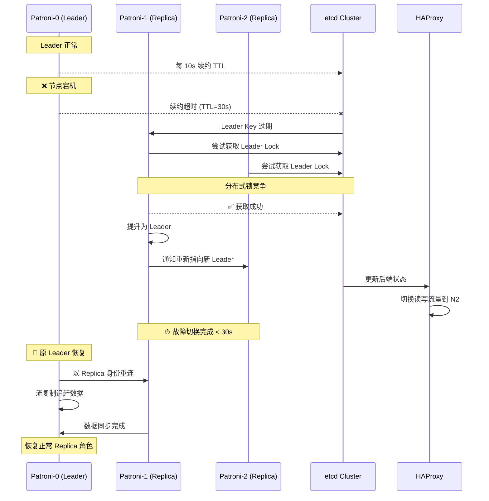

# PostgreSQL 高可用方案：Patroni + etcd + HAProxy

> **文档版本**: v1.0 | **更新日期**: 2026-07-15 | **适用组件**: postgres-patroni (StatefulSet)

---

## 一、方案概述

企业版采用 **Patroni + etcd + HAProxy** 三层架构实现 PostgreSQL 高可用。社区版使用单机 PostgreSQL 或 SQLite，企业版升级为生产级高可用数据库集群。

| 组件 | 角色 | 说明 |
|------|------|------|
| **Patroni** | 数据库集群管理 | 自动选主、故障切换、健康检测 |
| **etcd** | 一致性存储 | 存储集群状态与 Leader 选举元数据 |
| **HAProxy** | 读写流量分发 | 透明代理：读请求可分发到所有节点，写请求仅路由到 Leader |
| **PostgreSQL** | 数据库引擎 | 流复制：一主多从，异步/同步复制 |

### 核心优势

- **故障自动切换** < 30s：Leader 宕机后自动选举新主
- **数据零丢失**：同步复制模式下保证事务持久性
- **滚动升级**：Patroni 支持按节点滚动升级 PG 版本
- **读写分离**：HAProxy 智能路由，充分利用从节点读能力

---

## 二、架构图

```mermaid
graph TB
    subgraph "Kubernetes 集群"
        subgraph "form-a-data 命名空间"
            subgraph "Patroni StatefulSet (3 replicas)"
                PG0[postgres-patroni-0<br/>Leader<br/>:5432]
                PG1[postgres-patroni-1<br/>Replica<br/>:5432]
                PG2[postgres-patroni-2<br/>Replica<br/>:5432]
                PG0 -->|流复制| PG1
                PG0 -->|流复制| PG2
            end

            subgraph "etcd StatefulSet (3 replicas)"
                ETCD0[etcd-0<br/>:2379]
                ETCD1[etcd-1<br/>:2379]
                ETCD2[etcd-2<br/>:2379]
                ETCD0 --- ETCD1
                ETCD1 --- ETCD2
            end

            subgraph "HAProxy Service"
                HAP[haproxy<br/>:5000 (读写)<br/>:5001 (只读)]
            end

            PG0 -.->|健康上报| ETCD0
            PG0 -.->|健康上报| ETCD1
            PG0 -.->|健康上报| ETCD2
            PG1 -.->|健康上报| ETCD0
            PG1 -.->|健康上报| ETCD1
            PG1 -.->|健康上报| ETCD2
            PG2 -.->|健康上报| ETCD0
            PG2 -.->|健康上报| ETCD1
            PG2 -.->|健康上报| ETCD2

            HAP -->|读写 :5000| PG0
            HAP -->|只读 :5001| PG1
            HAP -->|只读 :5001| PG2
        end

        subgraph "应用层 (form-a-system)"
            N8N[n8n-worker]
            AUTH[auth-server]
        end

        N8N --> HAP
        AUTH --> HAP
    end
```

---

## 三、3 节点配置要点

### 3.1 Kubernetes 配置

```yaml
# StatefulSet 关键配置
apiVersion: apps/v1
kind: StatefulSet
metadata:
  name: postgres-patroni
  namespace: form-a-data
spec:
  replicas: 3
  serviceName: postgres-patroni-headless
  podManagementPolicy: OrderedReady
  template:
    spec:
      affinity:
        podAntiAffinity:
          preferredDuringScheduling:
          - weight: 100
            podAffinityTerm:
              labelSelector:
                matchLabels:
                  app: postgres-patroni
              topologyKey: kubernetes.io/hostname
      containers:
      - name: patroni
        image: registry.form-a.io/enterprise/patroni:3.0.0
        env:
        - name: PATRONI_SCOPE
          value: "form-a-pg-cluster"
        - name: PATRONI_NAMESPACE
          value: "form-a-data"
        - name: PATRONI_KUBERNETES_LABELS
          value: "{"app":"postgres-patroni"}"
        - name: PATRONI_POSTGRESQL_DATA_DIR
          value: "/data/pgdata"
        - name: PATRONI_REPLICATION_USERNAME
          value: "replicator"
        - name: PATRONI_REPLICATION_PASSWORD
          valueFrom:
            secretKeyRef:
              name: form-a-pg-secret
              key: replication-password
        - name: PATRONI_SUPERUSER_USERNAME
          value: "postgres"
        - name: PATRONI_SUPERUSER_PASSWORD
          valueFrom:
            secretKeyRef:
              name: form-a-pg-secret
              key: superuser-password
        ports:
        - containerPort: 5432
          name: postgres
        - containerPort: 8008
          name: patroni-api
        volumeMounts:
        - name: data
          mountPath: /data
  volumeClaimTemplates:
  - metadata:
      name: data
    spec:
      accessModes: [ "ReadWriteOnce" ]
      storageClassName: "standard"
      resources:
        requests:
          storage: 50Gi
```

### 3.2 反亲和性策略

每个 Patroni Pod 通过 `podAntiAffinity` 确保调度到不同的 Worker 节点上，避免一个节点宕机导致多个数据库节点同时不可用。

### 3.3 Patroni 配置要点

```yaml
# patroni.yml（容器的核心配置）
scope: form-a-pg-cluster
namespace: form-a-data
name: "{{ POD_NAME }}"

# etcd 后端
etcd:
  host: "etcd-0.etcd.form-a-data.svc.cluster.local:2379"
  # 自动发现 etcd 集群全部节点

# PostgreSQL 参数
postgresql:
  parameters:
    max_connections: 500
    shared_buffers: 1GB               # 设为内存的 25%
    effective_cache_size: 3GB         # 设为内存的 75%
    work_mem: 16MB
    maintenance_work_mem: 256MB
    wal_level: logical
    max_wal_senders: 10
    max_replication_slots: 10
    checkpoint_completion_target: 0.9
  pg_hba:
  - "host all all 0.0.0.0/0 md5"
  - "host replication replicator 0.0.0.0/0 md5"

# 复制模式（推荐同步 + 异步混合）
# synchronous_mode: true  # 开启同步复制保证数据零丢失
# synchronous_mode_strict: false  # 严格模式下 leader 等待至少一个 sync standby
```

---

## 四、故障自动切换流程

### 4.1 切换时序图



### 4.2 切换条件

| 场景 | 触发条件 | 切换耗时 | 数据一致性 |
|------|---------|---------|-----------|
| Leader 宕机 | etcd TTL 超时 (30s) | 10-30s | 异步模式可能丢失少量数据 |
| Leader 网络分区 | 多数 etcd 节点无法连接 | 30-45s | 原 Leader 被剔除 |
| 人工切换 | `patronictl switchover` | 5-15s | 零数据丢失 |
| 滚动升级 | Patroni 自动控制 | 每个节点 30-60s | 零数据丢失 |

### 4.3 Patroni CLI 操作

```bash
# 查看集群状态
kubectl exec -it postgres-patroni-0 -n form-a-data -- patronictl list

# 手动切换（将 Leader 切换到指定节点）
kubectl exec -it postgres-patroni-0 -n form-a-data -- \
  patronictl switchover form-a-pg-cluster --master postgres-patroni-0 --candidate postgres-patroni-1

# 查看历史切换记录
kubectl exec -it postgres-patroni-0 -n form-a-data -- patronictl history form-a-pg-cluster
```

---

## 五、备份恢复策略

### 5.1 定时备份方案（推荐）

使用 `pgBackRest` 或 `pg_dump` 实现定时备份。企业版内置 CronJob 备份编排：

```yaml
apiVersion: batch/v1
kind: CronJob
metadata:
  name: pg-backup-cron
  namespace: form-a-data
spec:
  schedule: "0 2 * * *"            # 每天凌晨 2:00
  jobTemplate:
    spec:
      template:
        spec:
          containers:
          - name: pg-backup
            image: registry.form-a.io/enterprise/patroni-backup:3.0.0
            env:
            - name: PGHOST
              value: "postgres-patroni-haproxy:5000"  # HAProxy 读写端点
            - name: PGUSER
              value: "postgres"
            - name: PGPASSWORD
              valueFrom:
                secretKeyRef:
                  name: form-a-pg-secret
                  key: superuser-password
            - name: BACKUP_TYPE
              value: "full"                           # full / incremental
            - name: BACKUP_DEST
              value: "s3://form-a-backup/postgres/"   # 备份目标（支持 S3/MinIO）
            volumeMounts:
            - name: backup-tmp
              mountPath: /tmp/backup
          restartPolicy: OnFailure
          volumes:
          - name: backup-tmp
            emptyDir: {}
```

### 5.2 备份策略表

| 备份类型 | 频率 | 保留周期 | 存储位置 | 恢复目标 |
|---------|------|---------|---------|---------|
| 全量备份 | 每日 | 7 天 | MinIO / S3 | 任意时间点 |
| WAL 归档 | 连续 | 7 天 | MinIO / S3 | 任意时间点 |
| 逻辑备份 | 每周 | 30 天 | MinIO / S3 | 跨版本迁移 |
| 快照备份 | 配合 CSI | 按需 | StorageClass | 快速恢复 |

### 5.3 恢复流程

```bash
# 场景 A：恢复到最新状态
# 1. 停掉 Patroni 集群
kubectl scale statefulset postgres-patroni -n form-a-data --replicas=0

# 2. 恢复数据目录（使用 pgBackRest）
kubectl run pg-restore --image=registry.form-a.io/enterprise/patroni-backup:3.0.0 \
  --restart=Never --namespace=form-a-data -- \
  pgbackrest --stanza=form-a --type=time "--target=2026-07-15 14:00:00+08" restore

# 3. 重新启动 Patroni
kubectl scale statefulset postgres-patroni -n form-a-data --replicas=3
```

### 5.4 恢复演练

建议企业用户**每月执行一次恢复演练**，验证备份的可用性。演练步骤：

1. 在沙箱环境创建独立的 Patroni 集群
2. 从备份还原数据
3. 验证数据完整性（行数校验、应用连接测试）
4. 记录 RTO（恢复时间目标）和 RPO（恢复点目标）

---

## 六、监控指标

| 指标 | 获取方式 | 告警阈值 |
|------|---------|---------|
| Patroni 集群状态 | `patronictl list` | 非 3 节点 Ready 告警 |
| 复制延迟 | `select * from pg_stat_replication;` | > 10MB |
| 连接数 | `select count(*) from pg_stat_activity;` | > 400 |
| 活跃事务时长 | `pg_stat_activity.query_start` | > 30min（长事务告警） |
| etcd leader 变更 | etcd metrics | 1h 内变更 > 3 次 |
| 磁盘使用率 | node exporter | > 80% |

企业版默认集成 Prometheus 抓取 Patroni 的 `/metrics` 端点，开箱即用。

---

## 七、常见问题

### Q: Patroni 切换后应用连接中断怎么办？
A: HAProxy 会自动检测切换并将连接路由到新 Leader。应用侧建议启用连接池（如 PgBouncer）并配置自动重连逻辑。

### Q: 能否从社区版的单机 PG 迁移？
A: 可以。使用 `pg_dump/pg_restore` 迁移数据，或使用 Patroni 的 `bootstrap` 模式将现有实例作为新集群的基础节点。

### Q: etcd 集群故障会影响 Patroni 吗？
A: 会影响。etcd 不可用时 Patroni 无法进行 Leader 选举。因此 etcd 也必须部署为 3 节点高可用集群。

### Q: 存储建议？
A: PostgreSQL 对磁盘 IOPS 敏感，推荐使用：
- **生产环境**：SSD/NVMe + 分布式存储（Ceph RBD / Longhorn）
- **高 IO 场景**：本地 SSD + hostPath（需配合节点反亲和 + 备份保障）

---

> 相关文档：`architecture-overview.md` · `scaling-guide.md` · `production-checklist.md`
