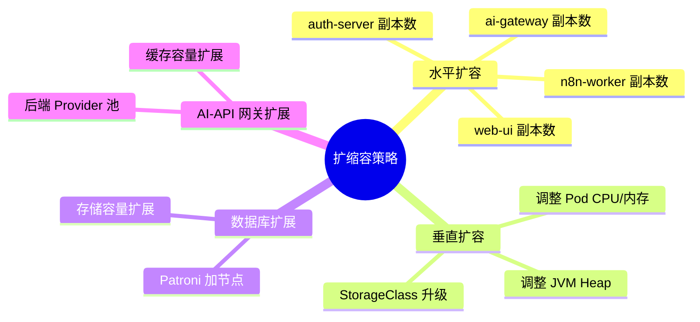
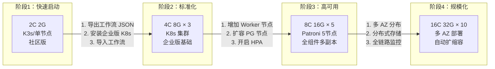

# Form-A 企业版扩缩容指南

> **文档版本**: v1.0 | **更新日期**: 2026-07-15

---

## 一、概述

企业版基于 Kubernetes 原生编排能力，支持多维度的扩缩容策略。本文档覆盖四种扩容场景及从小规格到企业级集群的完整迁移路径。

---

## 二、扩缩容维度总览



---

## 三、水平扩容（Horizontal Scaling）

### 3.1 n8n-worker 扩容

n8n-worker 是工作流执行引擎，是最需要水平扩容的组件。

#### 手动扩容

```bash
# 将副本数从 2 扩展到 5
kubectl scale deployment n8n-worker -n form-a-system --replicas=5

# 验证
kubectl get pods -n form-a-system -l app.kubernetes.io/component=n8n-worker
```

#### 自动扩缩容（HPA）

企业版默认启用 HPA，无需额外配置：

```yaml
apiVersion: autoscaling/v2
kind: HorizontalPodAutoscaler
metadata:
  name: n8n-worker-hpa
  namespace: form-a-system
spec:
  scaleTargetRef:
    apiVersion: apps/v1
    kind: Deployment
    name: n8n-worker
  minReplicas: 2
  maxReplicas: 10
  metrics:
  - type: Resource
    resource:
      name: cpu
      target:
        type: Utilization
        averageUtilization: 70
  - type: Resource
    resource:
      name: memory
      target:
        type: Utilization
        averageUtilization: 75
```

#### 扩容参考指标

| 并发工作流数 | 推荐 n8n-worker 副本数 | 说明 |
|-------------|----------------------|------|
| 0-50 | 2（默认） | 日常负载 |
| 50-200 | 4 | 中等规模 |
| 200-500 | 8 | 业务增长期 |
| 500+ | 10+ | 大规模，需同步扩展数据库 |

### 3.2 auth-server 扩容

```bash
# 扩容 auth-server
kubectl scale deployment auth-server -n form-a-system --replicas=3
```

auth-server 是无状态服务，扩容到更多副本可以提升认证请求的吞吐能力。建议和 n8n-worker 副本数保持大致比例（1:2 ~ 1:3）。

### 3.3 ai-gateway 扩容

```bash
# 扩容 AI API 网关
kubectl scale deployment ai-gateway -n form-a-system --replicas=3
```

AI API 网关的处理能力取决于后端 AI 模型的响应速度。建议监控网关的平均响应延迟和错误率，按需扩容。

#### 容量估算

```
AI-API 网关并发 ≈ 副本数 × (单 Pod 最大连接数)
                  = 3 × 200
                  = 600 并发
```

### 3.4 web-ui 扩容

```bash
kubectl scale deployment web-ui -n form-a-system --replicas=3
```

web-ui 为静态前端服务，资源消耗较低。2 副本通常足够，可视用户数量适当增加。

---

## 四、垂直扩容（Vertical Scaling）

### 4.1 调整 Pod 资源限制

```bash
# 通过 Helm values 调整
helm upgrade form-a-enterprise form-a/ai-cluster-enterprise \
  --namespace form-a-system \
  --set n8n-worker.resources.requests.cpu="2" \
  --set n8n-worker.resources.requests.memory="2Gi" \
  --set n8n-worker.resources.limits.cpu="4" \
  --set n8n-worker.resources.limits.memory="4Gi"
```

### 4.2 各组件典型资源规划

| 组件 | 最小（开发） | 推荐（生产） | 高负载 |
|------|------------|------------|--------|
| n8n-worker | 1C/1Gi | 2C/2Gi | 4C/8Gi |
| auth-server | 0.5C/512Mi | 1C/1Gi | 2C/2Gi |
| ai-gateway | 0.5C/512Mi | 1C/1Gi | 2C/4Gi |
| web-ui | 0.5C/256Mi | 0.5C/512Mi | 1C/1Gi |
| PostgreSQL | 1C/2Gi | 2C/4Gi | 4C/16Gi |
| etcd | 1C/1Gi | 2C/2Gi | 4C/4Gi |
| Redis | 0.5C/512Mi | 1C/1Gi | 2C/4Gi |

---

## 五、数据库扩展（PostgreSQL Patroni）

### 5.1 添加 Patroni 节点

```bash
# 从 3 节点扩展到 5 节点
kubectl scale statefulset postgres-patroni -n form-a-data --replicas=5
```

新增的节点会自动：
1. 启动 Patroni 进程
2. 向 etcd 注册自身
3. 从当前 Leader 流复制全量数据
4. 追上进度后成为 Replica 节点

#### 多节点建议

| 节点数 | 容错能力 | 适用场景 |
|--------|---------|---------|
| 3 | 容忍 1 节点故障 | 生产最小配置 |
| 5 | 容忍 2 节点故障 | 中大型生产 |
| 7 | 容忍 3 节点故障 | 金融级、高监管要求 |

### 5.2 存储容量扩展

```bash
# 修改 PVC 大小（需 StorageClass 支持 VolumeExpansion）
kubectl edit pvc data-postgres-patroni-0 -n form-a-data
# 修改 spec.resources.requests.storage: 50Gi → 100Gi

# 验证
kubectl get pvc -n form-a-data
```

> **注意**：缩减存储大小通常不被 Kubernetes 支持。请提前规划好存储扩容空间。

### 5.3 连接池扩展

当数据库连接数达到上限时，可通过 **PgBouncer** 连接池解决：

```yaml
# 企业版可选部署 PgBouncer Sidecar
n8n-worker:
  pgBouncer:
    enabled: true
    poolMode: "transaction"   # session / transaction / statement
    defaultPoolSize: 100
    maxPoolSize: 500
```

---

## 六、AI-API 网关扩展

### 6.1 后端 Provider 扩展

AI-API 网关支持多 Provider 后端，可动态添加：

```yaml
ai-gateway:
  providers:
    - name: "openai"
      baseUrl: "https://api.openai.com"
      rateLimit: 1000
    - name: "azure-openai"
      baseUrl: "https://xxx.openai.azure.com"
      rateLimit: 500
    - name: "local-llm"
      baseUrl: "http://llm-service.form-a-ai.svc:8000"
      rateLimit: 2000
```

### 6.2 缓存层扩展

AI-API 网关使用 Redis 作为响应缓存，减少重复请求。当缓存命中率下降时，需扩容 Redis：

```bash
# Redis 集群加节点
kubectl scale statefulset redis-sentinel -n form-a-data --replicas=5

# 增加 Redis 内存
helm upgrade form-a-enterprise form-a/ai-cluster-enterprise \
  --set redis-sentinel.persistence.size="20Gi"
```

---

## 七、从小规格到企业级集群的迁移路径



### 7.1 阶段1 → 阶段2：社区版迁移到企业版

```bash
# 1. 在社区版导出工作流
#   n8n 界面 → Workflows → Export All

# 2. 准备 K8s 集群（最小 3 节点）
# 参见 README.md 部署要求

# 3. 安装企业版
./deploy-enterprise.sh

# 4. 导入工作流
#   n8n 界面 → Workflows → Import

# 5. 重新配置凭证
#   n8n 界面 → Credentials → 更新 API Key / 数据库连接等

# 6. 切换 DNS 域名到企业版集群
```

### 7.2 阶段2 → 阶段3：企业级高可用化

```yaml
# Helm values 升级配置
n8n-worker:
  replicaCount: 4
  autoscaling:
    enabled: true
    minReplicas: 3
    maxReplicas: 10

postgres-patroni:
  replicaCount: 5    # 从 3 升级到 5

redis-sentinel:
  replicaCount: 5    # 从 3 升级到 5

# 资源升级
n8n-worker:
  resources:
    requests:
      cpu: "2"
      memory: "2Gi"
    limits:
      cpu: "4"
      memory: "8Gi"
```

### 7.3 阶段3 → 阶段4：大规模集群

| 动作 | 说明 |
|------|------|
| 多 AZ 部署 | PodAntiAffinity + TopologySpreadConstraints 跨可用区分布 |
| 分布式存储 | 替换默认 StorageClass 为 Ceph / Longhorn / NAS |
| 全链路监控 | 部署 Prometheus + Grafana + Loki + Tempo |
| 金丝雀发布 | n8n-worker 分批次滚动更新 |
| 全局负载均衡 | 多集群 Federation + Global Ingress |

---

## 八、扩缩容检查清单

| 操作前 | ✅ |
|--------|---|
| 确认集群有足够的空闲资源（kubectl top nodes） | ☐ |
| 确认 StorageClass 支持所需的扩容操作 | ☐ |
| 备份数据库（尤其是 StatefulSet 变更前） | ☐ |
| 检查 PodDisruptionBudget 配置 | ☐ |
| 评估扩容对 License 节点数的限制（如有） | ☐ |
| 通知运维团队预期变更窗口 | ☐ |

| 操作后 | ✅ |
|--------|---|
| 验证所有新 Pod 正常运行 | ☐ |
| 验证数据库复制状态正常 | ☐ |
| 验证工作流正常执行 | ☐ |
| 检查监控指标是否在预期范围 | ☐ |
| 更新容量规划文档 | ☐ |

---

> 相关文档：`postgres-high-availability.md` · `architecture-overview.md` · `production-checklist.md`
